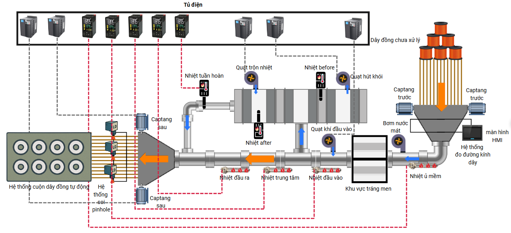
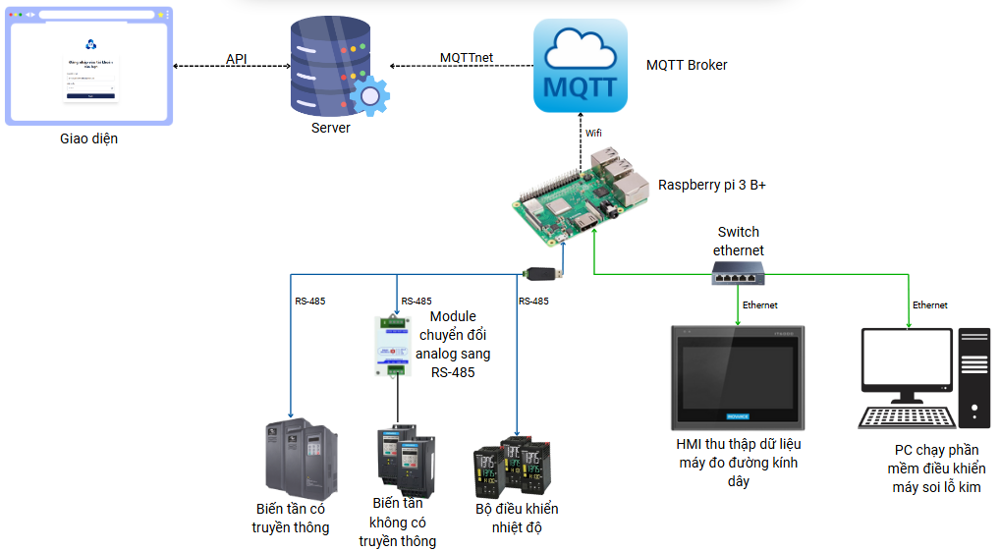
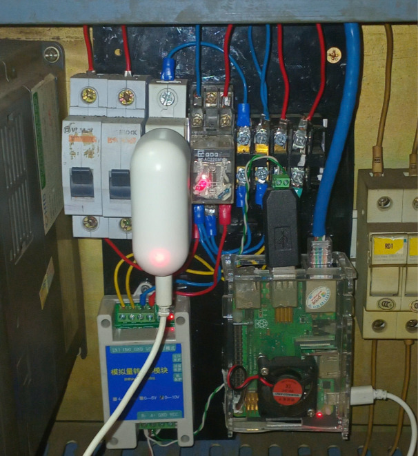

# ⚙️ HỆ THỐNG GIÁM SÁT DÂY CHUYỀN SẢN XUẤT DÂY ĐỒNG TRÁNG MEN

## 🏭 Tổng Quan Dây Chuyền

  

Dây chuyền sản xuất **dây đồng tráng men** bao gồm **bốn hệ thống chính**, mỗi hệ thống đảm nhiệm một vai trò quan trọng nhằm đảm bảo **chất lượng và hiệu suất sản xuất tối ưu**:

1. **Hệ thống đo đường kính dây**  
2. **Hệ thống gia nhiệt và tráng men**  
3. **Hệ thống soi lỗ kim**  
4. **Hệ thống cuộn dây tự động**

Toàn bộ dây chuyền được **giám sát và điều khiển thông qua Raspberry Pi 3 B+**, HMI, và phần mềm chuyên dụng, giúp:
- Quản lý dữ liệu tập trung  
- Phát hiện sớm lỗi kỹ thuật  
- Phân tích và tối ưu hóa quy trình vận hành  

---

## 🔍 Chi Tiết Các Hệ Thống

### 1️⃣ Hệ thống đo đường kính dây
- Là **bước đầu tiên** trong quy trình sản xuất.  
- Mục tiêu: kiểm tra và giám sát đường kính dây đồng trong suốt quá trình kéo dây.  
- Sử dụng thiết bị đo chuyên dụng (**tối đa 32 line đo đồng thời**).  
- Dữ liệu hiển thị trên **màn hình HMI**, giúp người vận hành theo dõi và điều chỉnh kịp thời.  

#### 📋 Thành phần:
- Máy đo đường kính dây (tối đa 32 line)  
- HMI truyền thông với máy đo  

---

### 2️⃣ Hệ thống gia nhiệt và tráng men
- Đảm bảo **lớp cách điện hoàn hảo** cho dây đồng.  
- Gồm 4 bộ điều khiển nhiệt điện trở để **gia nhiệt dây trước khi tráng men**, và 3 bộ điều khiển nhiệt độ tổng thể.  
- 5 biến tần điều khiển **quạt làm mát và động cơ kéo dây**, giúp **tối ưu tốc độ và hiệu quả truyền nhiệt**.  

#### 📋 Thành phần:
- 7 bộ điều khiển nhiệt độ  
- 5 biến tần điều khiển quạt và động cơ  

---

### 3️⃣ Hệ thống soi lỗ kim
- Kiểm tra lớp cách điện để phát hiện **các lỗi vi mô (lỗ kim)** không thể thấy bằng mắt thường.  
- Gồm **máy soi chuyên dụng** kết nối với **máy tính điều khiển** để chạy phần mềm giám sát và xử lý tín hiệu.  

#### 📋 Thành phần:
- Máy soi lỗ kim  
- Máy tính chạy phần mềm điều khiển  

---

### 4️⃣ Hệ thống cuộn dây tự động
- Cuộn dây đồng thành **các cuộn gọn gàng, đồng đều**, sẵn sàng cho đóng gói và vận chuyển.  
- Hoạt động **liên tục và đồng bộ** với các hệ thống phía trước, đảm bảo không gián đoạn dây chuyền.  

---

## 🧠 Sơ Đồ Nguyên Lý

  

Hệ thống gồm:
- **Bộ thu thập dữ liệu (Raspberry Pi 3 B+)** làm thiết bị trung tâm  
- Kết nối các thiết bị công nghiệp qua **RS-485 (Modbus RTU)** và **Ethernet (Modbus TCP)**  
- Gửi dữ liệu về **server qua giao thức MQTT**  
- Server tiếp nhận dữ liệu từ MQTT Broker thông qua thư viện MQTTnet, lưu trữ vào cơ sở dữ liệu và cung cấp các API để hiển thị thông tin trên giao diện người dùng. 
- Người quản lý có thể truy cập hệ thống từ xa để giám sát, cảnh báo và trích xuất báo cáo mọi lúc mọi nơi thông qua trình duyệt web trên máy tính hoặc điện thoại.

### 🧩 Kết nối phần cứng:

  

- Raspberry Pi kết nối với các thiết bị đo lường và HMI qua **RS-485**  
- Kết nối tới **PC và Server** qua **switch Ethernet**  
- Truyền dữ liệu qua **MQTT Broker** để hiển thị trên giao diện web  

---

## 🌐 Kiến Trúc Giao Tiếp Dữ Liệu Của Bộ Thu Thập Dữ Liệu

Hệ thống sử dụng **4 luồng chính** để thu thập và đồng bộ dữ liệu:

| Luồng | Chức năng | Giao thức |
|-------|------------|-----------|
| **Modbus RTU** | Thu thập dữ liệu từ thiết bị qua RS-485 | Modbus |
| **Modbus TCP** | Giao tiếp nhanh qua Ethernet | TCP/IP |
| **PC-Ethernet** | Kết nối và truy vấn dữ liệu từ SQL/Excel | SMB + SQL |
| **MQTT** | Truyền dữ liệu thời gian thực lên server/web | MQTT |

Tất cả các luồng đều sử dụng cơ chế **ThreadingLock** để đảm bảo **đồng bộ dữ liệu đa luồng** và **tránh xung đột khi đọc/ghi**.

---

## ⚡ Cơ Chế Xử Lý Lỗi

- ⏱ **Timeout** → gán giá trị `-1`, ghi nhật ký lỗi  
- ⚠️ **Mã lỗi Modbus** → lưu `E{error_code}` vào log  
- 💾 **MQTT retry mechanism** → thử lại 3–5 lần, lưu bản sao dữ liệu nếu thất bại  
- 🔐 **ThreadingLock** → đảm bảo dữ liệu nhất quán giữa các luồng  

---

## 🧮 Cơ Chế PC-Ethernet

- Kết nối tới cơ sở dữ liệu SQL hoặc file `.db`/Excel trên PC qua **giao thức SMB**  
- Ánh xạ đường dẫn đến `/mnt/pcshare` trên Raspberry Pi  
- Truy vấn trực tiếp các giá trị giám sát và đồng bộ vào **ThreadingLock**  
- Xử lý lỗi: mất kết nối, lỗi xác thực SMB, lỗi truy vấn SQL  

---

## 📡 Giao Tiếp MQTT

- Đóng gói dữ liệu dưới dạng **JSON**  
- Truyền dữ liệu lên **MQTT Broker**  
- Các hệ thống khác có thể **subscribe** để nhận dữ liệu thời gian thực  
- Dữ liệu được lưu cục bộ khi mất kết nối để **tránh mất mát thông tin**  

---

## 🧭 Giao Diện Web
Giao diện web quản lý có 5 trang chính:

| Trang | Mô tả |  
|--------|--------|  
| 🔐 **LOGIN** | Trang đăng nhập người dùng |  
| 📊 **DASHBOARD** | Trang trung tâm hiển thị tổng quan dữ liệu hệ thống |  
| 📈 **DATA DETAIL** | Trang dữ liệu chi tiết từng thông số (Temperature, Fan, Copper Diameter, LEAR, …) |  
| ⚠️ **ERROR HISTORY** | Trang lịch sử lỗi vận hành |  
| 📑 **REPORT** | Trang báo cáo: Report Chart, Export Excel, Report History |

Mã nguồn (front-end) của phần mềm giám sát và web có tại:
👉 [https://github.com/Leduvanh44/tienthinh_demo.git](https://github.com/Leduvanh44/tienthinh_demo.git)

---

